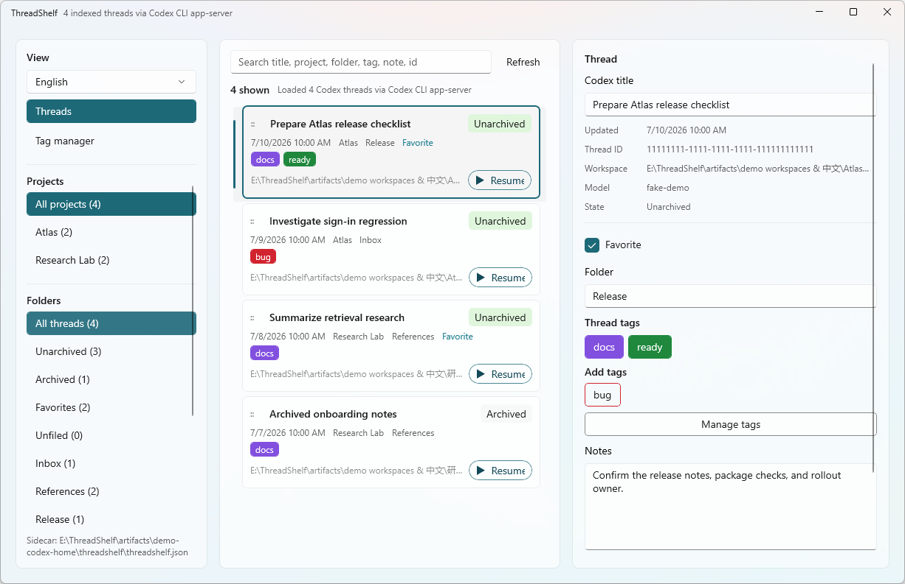

# ThreadShelf

English · [简体中文](README.md)

ThreadShelf is a local Windows task organizer for Codex users. It groups existing Codex sessions by project, folder, and tag, then adds search, favorites, notes, archive actions, and rename shortcuts. It is designed for individuals and developers whose task history is growing and who do not want to upload private conversations to another service.

ThreadShelf does not take over or rewrite Codex session files. Folders, tags, notes, favorites, and project display aliases live in a separate sidecar. Archive, unarchive, and thread-title changes are performed only through the public Codex CLI `app-server` protocol.



## Highlights

- Group Codex projects by their real workspace and organize tasks into project-scoped ThreadShelf folders.
- Drag tasks to folders; dropping on Unfiled clears the folder immediately.
- Search titles, projects, folders, tags, notes, IDs, models, and archive state.
- Manage global colored tags with descriptions; tag renames migrate task references.
- Edit notes, favorites, and Codex thread titles; archive or unarchive from the task card.
- Assign a ThreadShelf-only project alias or atomically rename a folder within the current project.
- Open the real directory from the workspace link in the details pane.
- Start a new interactive Codex task from a project or resume an existing session from its card; desktop is preferred with automatic CLI fallback.
- Use Simplified Chinese or English: follow the system by default, or persist a manual choice.
- Use CLI and MCP automation to organize tasks safely from scripts and AI assistants.

## Requirements

- Windows 10 version 1809 (build 17763) or newer.
- [.NET 10 SDK](https://dotnet.microsoft.com/download/dotnet/10.0) when building from source.
- The Codex desktop app or an installed, executable Codex CLI. Interactive Resume/New task needs at least one.
- Installing Codex CLI as well is recommended. With desktop only, ThreadShelf imports local JSONL read-only; the CLI `app-server` avoids direct reads of active session files and enables archive, unarchive, and title rename.

The app uses a self-contained Windows App SDK build, so a separate Windows App Runtime installation is not required.

## Install and run

```powershell
git clone https://github.com/ReneeGA2020/ThreadShelf.git
cd ThreadShelf
dotnet build ThreadShelf.App\ThreadShelf.App.csproj -p:Platform=x64
dotnet run --project ThreadShelf.App\ThreadShelf.App.csproj -p:Platform=x64
```

You can also run the built executable directly:

```powershell
.\ThreadShelf.App\bin\x64\Debug\net10.0-windows10.0.22621.0\ThreadShelf.App.exe
```

On ARM64 devices, replace `x64` with `ARM64`.

### Install Codex CLI (recommended)

Codex desktop and Codex CLI are separate installation and discovery surfaces. Even when desktop works, install the CLI by following the [official Codex CLI documentation](https://learn.chatgpt.com/docs/codex/cli). If Node.js is installed, run:

```powershell
npm install -g @openai/codex@latest
codex --version
```

Restart ThreadShelf after installation. It will prefer `codex app-server`. If the CLI is still not found, set `THREADSHELF_CODEX_CLI` to `codex.exe`, `codex.cmd`, or `codex.bat`.

### Publish win-x64 NativeAOT

The repository includes a directly usable Release NativeAOT profile:

```powershell
dotnet publish ThreadShelf.App\ThreadShelf.App.csproj -p:PublishProfile=WinX64NativeAot
```

The complete output is under `ThreadShelf.App\bin\publish\win-x64\`. This is a self-contained, unpackaged x64 folder publish; distribute the whole folder as an archive rather than copying only `ThreadShelf.App.exe`. The profile preserves English/Chinese globalization. `_CopyWinUIResourcesForPublish` copies the required unpackaged WinUI `ThreadShelf.App.pri`, plus any project-generated `.xbf` files, into the publish directory.

Only a `win-x64` profile is provided today. ARM64 can be built from source but does not yet have a Release publish profile. Release/AOT excludes Reactor devtools. The upstream Reactor package may currently emit an aggregate `IL2104`; ThreadShelf itself emits no IL2026/IL3050 warnings, and the published executable passes the UI smoke test below.

## First launch

1. Start ThreadShelf. It tries `codex app-server` first and automatically switches to read-only local JSONL import when the provider cannot start. Installing Codex desktop alone does not imply that the CLI is available.
2. Choose System default, English, or Simplified Chinese in the upper-left selector. A manual choice is saved in a separate preference file.
3. Choose a project and folder on the left, a task in the center, and edit its folder, tags, notes, or favorite state on the right.
4. Use the status button in the task card to archive or unarchive. When app-server is unavailable, the button is disabled and explains why.
5. Right-click an ordinary project or folder to rename it. A project rename is a ThreadShelf display alias; it never renames a Codex project or disk directory.

## Everyday workflows

### Organize tasks

- Click a task title to select it, or drag its dedicated `::` handle to a folder.
- Set favorite, folder, tags, and notes in the details pane. Tags, favorites, and drag operations save immediately; folder and notes save on Enter or lost focus.
- Combine search with project, folder, and tag filters. Unarchived and Archived views update immediately after a state change.

### Open, create, and resume Codex tasks

- Workspace is a link in the details pane; it opens the real directory in Windows File Explorer. A missing or nonexistent path disables the link and explains why.
- The card and details pane expose one Resume action. When Codex desktop is detected it uses `codex://threads/<id>`; otherwise it runs `codex resume -C <workspace> <session-id>` with structured arguments in a visible terminal.
- Right-clicking an ordinary project and choosing New task uses the same strategy: `codex://threads/new?path=<workspace>` for desktop, or `codex -C <workspace>` only when CLI is the available provider.
- A project display alias is never used as a file-system path.
- Entries are disabled with a localized reason when neither desktop nor CLI is available or workspace/session data is invalid. CLI fallback prefers Windows Terminal and otherwise starts Codex directly in a visible console.
- The optional hover `+` was evaluated as a pointer experiment. Keeping the row hit target fixed and the context menu as the baseline was more stable, so the hover button is not currently shown.

### Manage tags

Open Tag manager to create, edit, rename, or delete global tags. Deleting a tag also removes task references, so confirm the target tag first.

## Data, privacy, and backup

Paths are under `%USERPROFILE%\.codex` by default, or under the directory selected by `CODEX_HOME`.

| Data | Path | ThreadShelf behavior |
| --- | --- | --- |
| Codex session index | `session_index.jsonl` | Read-only in fallback mode |
| Codex sessions | `sessions/`, `archived_sessions/` | Read-only in fallback mode; never written |
| ThreadShelf metadata | `threadshelf/threadshelf.json` | Stores folders, tags, notes, favorites, and project aliases |
| ThreadShelf preferences | `threadshelf/preferences.json` | Stores the manual language choice |

Back up the `threadshelf` directory to preserve ThreadShelf-owned data. The sidecar may contain private notes and thread IDs, so protect it like Codex history. ThreadShelf does not send this data over the network.

## Codex provider and fallback

| Capability | app-server available | Local JSONL fallback |
| --- | --- | --- |
| Browse, search, and filter tasks | Yes | Yes |
| Folders, tags, notes, favorites, project aliases | Yes (ThreadShelf sidecar write) | Yes (ThreadShelf sidecar write) |
| Reveal a session file | Yes | Yes, when the file exists |
| Archive, unarchive, rename a thread title | Yes (native Codex action) | No; controls are disabled |
| Start/resume an interactive task | Codex desktop preferred; otherwise available when CLI and workspace are valid | Independent of app-server provider |

ThreadShelf resolves the CLI in this order: a valid `THREADSHELF_CODEX_CLI`, the common Windows installation location, then `codex` on `PATH`. The override must point to an existing executable.

Local fallback opens JSONL in shared read-only mode and does not block Codex desktop from writing. If an active session file is still held exclusively for a moment, ThreadShelf shows a retryable error page; try again shortly, or install the CLI to use `app-server`.

```powershell
$env:THREADSHELF_CODEX_CLI = "$env:LOCALAPPDATA\Programs\OpenAI\Codex\bin\codex.exe"
dotnet run --project ThreadShelf.App\ThreadShelf.App.csproj -p:Platform=x64
```

## Demo data and screenshot reproduction

This script uses only the repository's fake app-server and `artifacts/demo-codex-home`. It does not read or modify real Codex data:

```powershell
powershell -ExecutionPolicy Bypass -File .\scripts\Start-ThreadShelfDemo.ps1 -Language en-US
```

The script builds the app, creates fictional projects, tasks, tags, and notes, and launches ThreadShelf. The README screenshot is generated from this fixture and can be updated safely.

## Advanced: CLI and MCP

```powershell
dotnet run --project ThreadShelf.Cli -- threads list --json
dotnet run --project ThreadShelf.Cli -- threads list --workspace E:\Widget --updated-after 2026-07-01T00:00:00Z --fields id,title,updatedAt,tags --format jsonl
dotnet run --project ThreadShelf.Cli -- threads search "follow up" --json
dotnet run --project ThreadShelf.Cli -- threads batch-update --file organization.json --yes --json
dotnet run --project ThreadShelf.Mcp
```

List/search support exact workspace paths, timezone-aware created/updated bounds, excluded IDs, and compact field projection. Long-lived MCP processes reuse an in-memory thread index; use `refresh` for a forced provider reload. Batch organization should prefer incremental `addTags` / `removeTags` and inspect each thread's before/after with `dryRun`; legacy `tags` remains a compatible explicit full replacement.

See the [AI/CLI/MCP guide](docs/ai-interface.md) for tools, parameters, permissions, success/error envelopes, and safety boundaries. Normal automation should use MCP or CLI instead of editing the sidecar directly, and it must never edit Codex JSONL.

## Troubleshooting

### A Codex task cannot be resumed or created

Confirm that Codex desktop registered the `codex:` protocol, or confirm that `codex --version` works and point `THREADSHELF_CODEX_CLI` to a real `codex.exe`. When neither is available, ThreadShelf can still browse tasks and edit sidecar metadata; archive/title operations that require `app-server` are disabled independently.

### No tasks appear

Check that `CODEX_HOME` points to the intended directory and that `session_index.jsonl`, `sessions`, or `archived_sessions` exists. Clear search, switch to All projects / All threads, and click Refresh.

### A session file is "being used by another process"

This usually occurs when only Codex desktop is installed, ThreadShelf is loading through local JSONL fallback, and desktop is writing the active session. The current version uses shared read-only access; if the file is still held exclusively for a moment, click Try again on the error page. Installing Codex CLI and confirming that `codex --version` works is recommended so ThreadShelf can prefer `app-server`.

### Archive or rename is unavailable

These are native app-server writes. Read the status message at the bottom of the window and verify that the CLI can start `codex app-server`. ThreadShelf never fakes a local success state.

### A project rename does not appear in Codex desktop

The current public app-server protocol has no project-rename method, so ThreadShelf uses a display alias. It does not change a Codex desktop project, CLI workspace, or disk directory.

### Where is my data?

The sidecar path is shown at the lower left of the window. The language preference is in `preferences.json` beside it.

## Uninstall

1. Close ThreadShelf and remove the cloned or published application directory.
2. To remove ThreadShelf metadata too, back it up first, then delete `%USERPROFILE%\.codex\threadshelf` (or `$env:CODEX_HOME\threadshelf`).
3. Do not delete `sessions`, `archived_sessions`, or `session_index.jsonl`; they belong to Codex.

## Development checks

The code is organized by responsibility: desktop entry/composition lives in `ThreadShelf.App/Program.cs` and `App.cs`, page state in `State/ThreadShelfController.cs`, and UI features in `Components/`. Core keeps shared use cases, sidecar persistence, providers, and native/system actions in `ThreadShelfService.cs`, `Persistence/`, `Sources/`, and `Native/`. CLI and MCP bootstrap, dispatch/catalog, and handlers are separate files as well. Add MCP tools through the descriptor registry in `ThreadShelf.Mcp/ToolCatalog.cs` so each schema stays bound to its handler.

```powershell
dotnet test tests\ThreadShelf.Tests\ThreadShelf.Tests.csproj
dotnet build ThreadShelf.App\ThreadShelf.App.csproj -p:Platform=x64
dotnet publish ThreadShelf.App\ThreadShelf.App.csproj -p:PublishProfile=WinX64NativeAot
powershell -ExecutionPolicy Bypass -File .\scripts\Test-ThreadShelfUi.ps1
powershell -ExecutionPolicy Bypass -File .\.codex\skills\thread-shelf-reactor\scripts\Test-ThreadShelfMcp.ps1
```

Licensed under the [MIT License](LICENSE).
